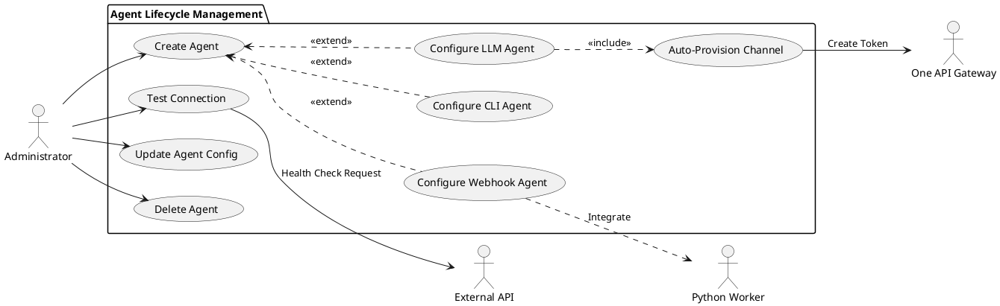
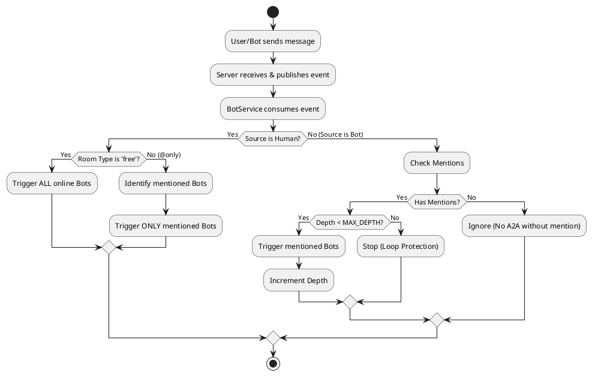
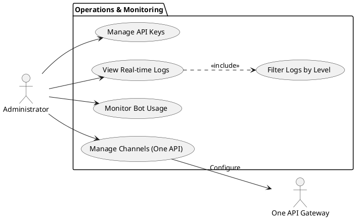

# 1. 场景视图 (Scenario View)

场景视图通过**用例 (Use Cases)** 描述系统的功能需求，展示了系统的主要参与者及其核心交互流程。为了更清晰地表达业务逻辑，本章节将核心业务划分为三大场景集：**智能体全生命周期管理**、**多模式聊天室交互** 和 **企业级运维与监控**。

## 1.1 核心参与者 (Actors)

| 参与者 | 描述 | 职责 |
| :--- | :--- | :--- |
| **User (普通用户)** | 系统的最终使用者 | 在聊天室中与机器人或其他用户交互，查看历史消息。 |
| **Administrator (管理员)** | 系统的运维与管理者 | 配置机器人参数、管理 API 密钥、监控系统日志与运行状态。 |
| **Bot (智能体/Agent)** | 系统中的自动化代理 | 接收用户指令，调用 LLM 或执行本地脚本，并在聊天室中回复。 |
| **External Worker (外部工作者)** | 独立计算单元 | 接收 Webhook 触发，执行复杂数据分析或业务逻辑，并异步回传结果。 |
| **External System (外部系统)** | 第三方服务 | 包括 OpenAI API, Aliyun DashScope, Webhook 目标服务等。 |
| **One API Gateway (内部网关)** | 统一 LLM 网关 | 系统内置的中间件，负责统一不同 LLM 厂商的接口格式和 Token 管理。 |

---

## 1.2 场景 A: 智能体全生命周期管理 (Agent Lifecycle)

本场景描述了管理员如何创建、配置、测试及维护智能体的全过程。系统支持多种类型的智能体接入方式，以适应不同的业务需求。

### 1.2.1 子场景：多类型智能体接入

根据 `provider_type` 的不同，创建流程存在差异：

1.  **LLM 接入 (Type: `llm`)**:
    *   **描述**: 直接对接 OpenAI、Aliyun 等大模型 API。
    *   **One API 集成**:
        *   系统会自动检测是否配置了 One API。
        *   若启用，`BotService` 会自动调用 `OneApiService` 为该 Bot 创建独立的 **User** (租户) 和 **Channel** (渠道)。
        *   生成的专属 Token 将被注入到 Bot 的环境变量中，实现流量隔离和额度监控。
    *   **配置项**: `Base URL` (指向 One API), `API Key`, `Model Name`, `System Prompt`。
    *   **流程**: 管理员填写配置 -> 系统保存 -> BotRuntime 实例化 `LlmAdaptor` -> 调用 One API 接口。
2.  **本地 CLI 桥接 (Type: `cli`)**:
    *   **描述**: 允许智能体在服务器本地执行 Shell 命令（如 `claude` 命令行工具）。
    *   **配置项**: `Command` (执行指令), `CWD` (工作目录)。
    *   **流程**: 管理员配置 -> BotRuntime 实例化 `CliAdaptor` -> 通过 `child_process` 交互。
3.  **Webhook 集成 (Type: `webhook`)**:
    *   **描述**: 将消息转发给外部 HTTP 服务，适用于对接 **Python Worker** 或其他业务系统。
    *   **配置项**: `Endpoint URL` (Worker 地址), `Auth Token`。
    *   **流程**: 管理员配置 -> BotRuntime 实例化 `WebhookAdaptor` -> 消息通过 HTTP POST 转发给 Worker。

### 1.2.2 子场景：连接测试与保活

在正式部署前或运行过程中，系统提供连接测试机制：
*   **测试连接 (Test Connection)**: 管理员在创建/编辑页面点击测试 -> 后端 `BotRuntime.testConnection()` -> 调用对应 Adaptor 的 `checkStatus()` -> 返回 `online` 或错误信息。
*   **状态监控**: 系统定期（或在交互时）更新 `bot_stats` 表中的 `last_active` 时间戳，用于前端展示在线/离线状态。

### 1.2.3 用例图 (Agent Lifecycle)

---

## 1.3 场景 B: 多模式聊天室交互 (Chatroom Interaction)

本场景描述了用户与智能体在不同类型聊天室中的交互逻辑，以及智能体之间的协作机制。

### 1.3.1 子场景：聊天室模式差异

系统支持两种聊天室模式，由 `rooms` 表中的 `type` 字段控制：

1.  **自由讨论区 (Type: `free`)**:
    *   **逻辑**: 用户发送消息 -> `BotService` 接收 -> **所有在线 Bot** 均被触发（无需提及）。
    *   **适用**: 头脑风暴、公共大厅。
2.  **指令控制区 (Type: `@only` / `focused`)**:
    *   **逻辑**: 用户发送消息 -> `BotService` 接收 -> **仅检查被 @ 的 Bot** -> 只有被提及的 Bot 才会触发回复。
    *   **适用**: 客服群、精准指令执行。

### 1.3.2 子场景：智能体协作链 (A2A Loop Control)

智能体可以回复其他智能体的消息（Agent-to-Agent），从而形成工作流，但必须防止死循环：

*   **触发条件**: Bot A 发出消息 -> `BotService` 接收 -> 检查来源是否为 Bot。
*   **循环检测**:
    *   系统在 `metadata` 中维护 `depth` (深度) 计数器。
    *   如果 `depth >= MAX_DEPTH` (默认为 2)，则停止触发后续 Bot，中断链条。
    *   Bot 之间的触发**强制要求显式 @提及**，即使在自由聊天室中也是如此，以避免无意义的对话噪音。

### 1.3.3 子场景：多模态消息处理

*   **图片上传**: 用户选择图片 -> 前端压缩并转 Base64 -> 调用上传接口 -> 后端保存并返回 URL。
*   **消息渲染**: 消息体中包含 `messageType: 'image'` 和 `mediaUrl` -> 前端渲染为图片卡片。
*   **Bot 处理**: 若 Bot 支持多模态（如 GPT-4o），后端会将图片 URL 包含在上下文发送给 LLM。

### 1.3.4 活动图 (Message Routing Strategy)

---

## 1.4 场景 C: 企业级运维与监控 (Enterprise Ops)

本场景关注系统的可观测性和安全性管理。

### 1.4.1 子场景：API 密钥池管理 (One API Integrated)

*   **统一网关**: 所有 LLM 请求通过 One API 网关转发，管理员无需在 OpenClaw 中直接管理明文 API Key。
*   **渠道管理**: 管理员在 One API 仪表盘中配置 OpenAI, Anthropic 等上游渠道。
*   **令牌分发**: OpenClaw 通过 `OneApiService` 自动为每个 Bot 申请子令牌，实现细粒度的额度控制和用量统计。

### 1.4.2 子场景：实时日志审计流

*   **日志采集**: 系统各模块（Server, BotService, Adaptor）调用 `LoggerService`。
*   **持久化**: 日志写入 SQLite `system_logs` 表，包含 `level`, `agent_id`, `details`。
*   **实时广播**: 前端 `LogPage` 通过轮询或 WebSocket 订阅（规划中）实时获取最新日志，支持按 `ERROR`/`WARN` 级别筛选，帮助管理员快速定位 Bot 运行时的异常（如 API 超时、上下文超长）。

### 1.4.3 用例图 (Ops & Monitoring)

