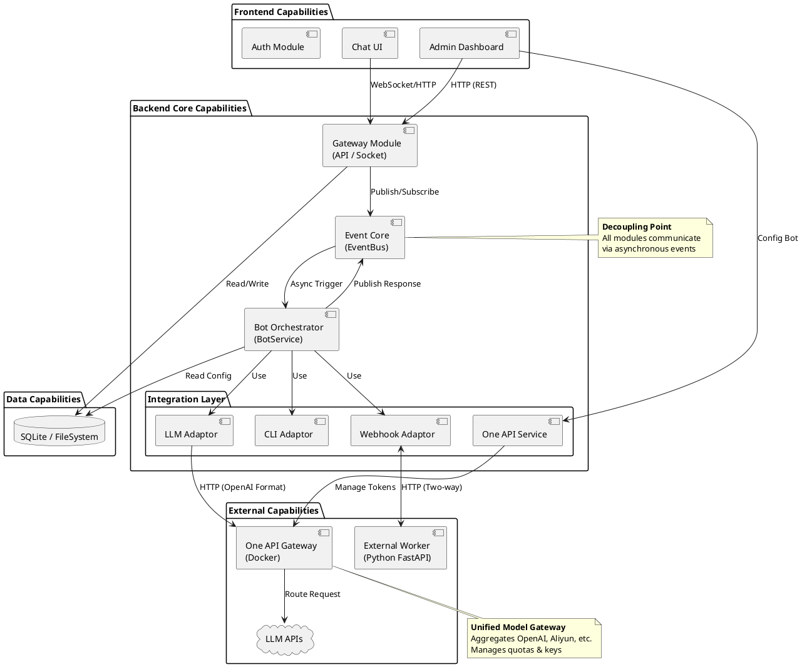
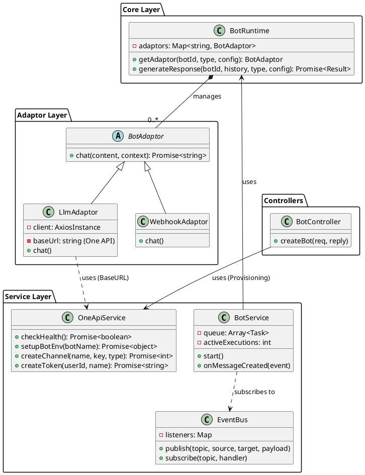

# 2. 逻辑视图 (Logical View)

逻辑视图展示了系统的静态结构，通过分层设计、类与组件的关系，揭示了系统内部模块如何协作以支撑业务功能。

## 2.1 系统分层架构

OpenClaw 采用典型的 **分层架构 (Layered Architecture)**，各层职责清晰，通过接口与事件总线解耦。

| 层级 | 模块 | 职责描述 | 关键技术 |
| :--- | :--- | :--- | :--- |
| **Presentation Layer (表现层)** | Frontend UI | 负责用户交互、状态展示及 WebSocket 通信。 | React, Vite, Tailwind CSS |
| **API Layer (接口层)** | REST API, Socket.IO | 处理 HTTP 请求与实时连接，作为系统入口。 | Fastify, Socket.IO |
| **Service Layer (业务逻辑层)** | BotService, EventBus | 编排核心业务流程，如消息路由、任务调度。 | Node.js EventEmitter, Queue |
| **Core Layer (核心运行时)** | BotRuntime | 管理 Bot 实例生命周期，动态加载适配器。 | Class Registry, Adaptor Pattern |
| **Integration Layer (集成层)** | OneApiService | 封装与 One API 的交互，负责渠道与 Token 管理。 | Axios |
| **Adaptor Layer (适配器层)** | LlmAdaptor, CliAdaptor... | 对接具体执行环境，屏蔽底层差异。 | Axios, Child Process |
| **Data Layer (数据持久层)** | SQLite DB | 存储配置、消息历史及系统日志。 | sqlite3, fs |

## 2.2 功能模块交互视图 (Module Interaction View)

本视图从功能模块的角度展示了系统的前后台能力划分及模块间的解耦关系。

*   **前台模块 (Frontend Modules)**: 聚焦于用户体验，包括聊天界面、管理后台及认证模块。
*   **后台核心模块 (Backend Core Modules)**:
    *   **Gateway**: 统一接入层，处理 REST API 和 WebSocket 协议转换。
    *   **Event Core**: 消息中枢，所有业务逻辑均通过 EventBus 进行异步解耦。
    *   **Bot Orchestrator**: 智能体编排器，负责并发控制、任务队列及上下文管理。
    *   **Integration Layer**: 集成层，通过标准化的适配器接口对接不同的执行环境。
    *   **Model Gateway (One API)**: 统一 LLM 网关，负责所有 LLM 调用的路由、鉴权和额度控制。
*   **外部能力 (External Capabilities)**:
    *   **External Worker (Python)**: 独立部署的计算单元，通过 Webhook 与主系统交互。

## 2.3 核心类图 (Class Diagram)

以下类图展示了后端核心模块的静态关系，特别是 `OneApiService` 如何集成到服务层中。

## 2.4 External Worker Subsystem

**外部 Worker 子系统** 是为了应对复杂计算或特定语言生态（如 Python 数据分析）而设计的独立服务模块。

*   **角色**: 独立的服务进程，不与主 Node.js 进程共享内存。
*   **通信机制**:
    *   **下行 (Command)**: 主系统通过 `WebhookAdaptor` 向 Worker 发送 HTTP POST 请求，携带任务上下文。
    *   **上行 (Callback)**: Worker 处理完成后，主动调用主系统的 `POST /api/chat/send` 接口回传结果，或 `POST /api/events` 触发新的业务流程。
*   **防腐层**: `WebhookAdaptor` 屏蔽了 Worker 的具体实现细节（如 Python/Go/Java），使得核心系统只需关注标准的 `chat()` 接口。

---

**设计决策说明**:
*   **引入 One API 的价值**: 通过引入 `OneApiService` 和 `One API Gateway`，系统解耦了与底层 LLM 供应商的直接依赖。任何支持 OpenAI 格式的模型都可以无缝接入，且可以通过 One API 的界面统一管理成本和渠道健康度。
