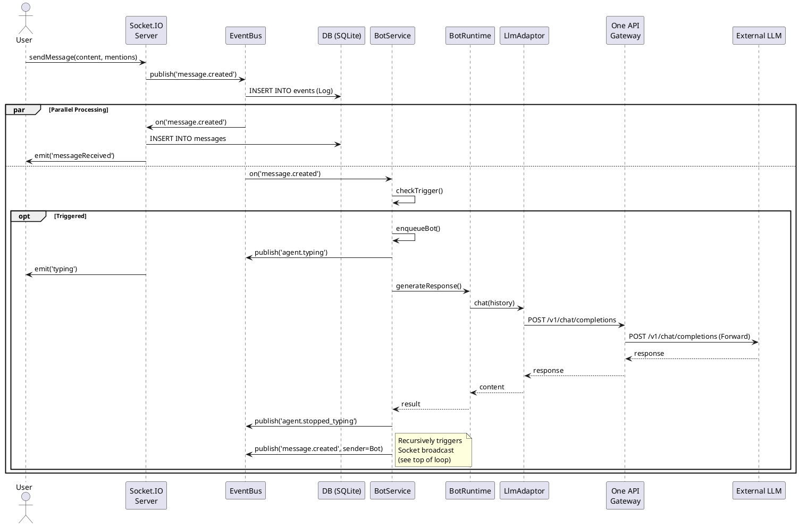
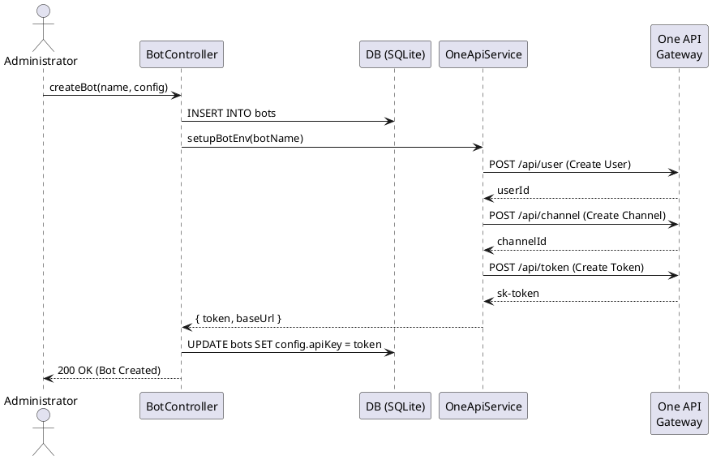

# 3. 过程视图 (Process View)

过程视图描述了系统的动态行为，展示了系统在运行时如何处理并发、消息流转和异步事件。它详细说明了消息从发送到最终被 Bot 响应的完整生命周期，以及各个组件之间的协作机制。

## 3.1 核心流程：消息发送与机器人回复

此流程是 OpenClaw 系统的核心交互路径。它描述了当用户发送消息时，系统如何处理并触发相关机器人进行回复。

### 3.1.1 流程步骤

1.  **消息发送**: 用户通过 Socket.IO 客户端发送消息（包含内容、房间 ID、Mentions）。
2.  **事件发布**: Socket Server 接收消息，将其封装为 `message.created` 事件，并通过 EventBus 发布。
3.  **广播与持久化**: Socket Server 同时监听该事件，负责将其广播给房间内的所有客户端，并写入 `messages` 数据库表。
4.  **Bot 触发检测**: `BotService` 作为消费者监听 `message.created` 事件。它会根据消息来源（User vs Bot）、房间类型（Free vs @Only）和提及情况（Mentions）判断是否触发 Bot。
5.  **任务队列**: 如果触发，`BotService` 将任务加入内部队列 (`queue`)，以控制并发量（`MAX_CONCURRENT`，默认为 3）。
6.  **执行 Bot**: `BotService` 处理队列，调用 `BotRuntime.generateResponse()`。
7.  **调用 LLM/Adapter**: `BotRuntime` 根据 Bot 类型实例化对应的 `BotAdaptor`（如 `LlmAdaptor`）。
    *   **One API 路由**: `LlmAdaptor` 使用配置中的 `Base URL` (指向 One API Gateway) 和 Bot 专属 Token 发起请求。
8.  **生成回复**: One API 将请求转发给底层 LLM (如 OpenAI)，并将响应返回给 Adaptor。
9.  **回复发布**: `BotService` 将 Bot 的回复封装为新的 `message.created` 事件，发布到 EventBus。
10. **循环处理**: 流程回到步骤 3，Server 广播 Bot 的回复。如果 Bot 回复触发了其他 Bot（A2A），则重复步骤 4-9（受 `depth` 限制）。

### 3.1.2 序列图 (Sequence Diagram)



## 3.2 智能体创建与 One API 配置流程 (Bot Provisioning)

当管理员创建一个新的 LLM Bot 时，系统会自动与 One API 交互以配置运行环境。

### 3.2.1 流程步骤

1.  **提交请求**: 管理员在前端填写 Bot 信息（名称、模型等）并提交。
2.  **创建 Bot**: `BotController` 将 Bot 信息写入数据库。
3.  **环境配置**: `BotController` 调用 `OneApiService.setupBotEnv()`。
    *   **创建用户**: 在 One API 中为该 Bot 创建一个独立用户。
    *   **创建渠道**: 配置 One API 渠道（Channel），指向真实的 LLM Provider。
    *   **创建令牌**: 为该 Bot 用户生成一个永久访问令牌（Token）。
4.  **更新配置**: `OneApiService` 将生成的令牌和 One API 地址回写到 Bot 的配置中。
5.  **完成**: 返回创建成功响应。

### 3.2.2 序列图 (Provisioning Sequence)



## 3.3 异步任务处理流程 (Async Worker Flow)

对于需要长时间计算或复杂逻辑处理的任务（如数据分析、生成报表），系统通过 `WebhookAdaptor` 与外部 `Python Worker` 进行异步交互。

### 3.3.1 流程步骤

1.  **触发**: 用户发送消息，`BotService` 识别出该 Bot 配置为 `provider_type: 'webhook'`。
2.  **下发指令**: `BotRuntime` 调用 `WebhookAdaptor`，向 Python Worker 发送 HTTP POST 请求。
3.  **快速响应 (ACK)**: Worker 接收请求后，立即返回 HTTP 200 OK，表示任务已接收。此时主流程不会阻塞等待结果。
4.  **异步执行**: Worker 在后台线程中处理任务（如查询数据库、运行 Pandas 分析）。
5.  **主动回传**: 任务完成后，Worker 调用 OpenClaw 的 `POST /api/chat/send` 接口。
6.  **结果推送**: OpenClaw Server 接收请求，通过 EventBus 发布新的 `message.created` 事件，最终广播给用户。

### 3.3.2 序列图 (Webhook Async Processing)

```plantuml
@startuml
actor User
participant "BotService" as Service
participant "WebhookAdaptor" as Adaptor
participant "Python Worker\n(External)" as Worker
participant "Backend API\n(OpenClaw)" as API
participant "EventBus" as Bus

User -> Service : Message Event
Service -> Service : Trigger Webhook Bot
Service -> Bus : publish('agent.typing')

Service -> Adaptor : chat(content, context)
Adaptor -> Worker : POST /events (Payload)
activate Worker
Worker --> Adaptor : 200 OK (Task Accepted)
deactivate Worker

Adaptor --> Service : (Empty/ACK)
note right
  Main thread released.
  User sees "Typing..."
end note

... Async Processing (e.g. 30s) ...

activate Worker
Worker -> Worker : Execute Logic
Worker -> API : POST /api/chat/send (Result)
deactivate Worker

API -> Bus : publish('message.created')
Bus -> Service : on('message.created')
Service -> Bus : publish('agent.stopped_typing')

@enduml
```

## 3.4 异步事件流与并发控制

OpenClaw 采用基于 EventBus 的异步架构，并通过队列机制控制并发。

### 3.4.1 EventBus 机制

*   **解耦**: 生产者（Socket Server, Webhook Handler）只需发布事件，无需关心消费者（BotService, LoggerService）的存在。
*   **多订阅者**: 同一事件可被多个服务订阅。例如，`message.created` 同时被 `BotService`（触发回复）和 `LoggerService`（审计日志）消费。
*   **持久化**: 所有事件在内存分发前均被写入 `events` 表，确保系统重启后的可追溯性。

### 3.4.2 任务队列 (Task Queue)

为了防止大量并发请求导致 LLM API 限流或本地资源耗尽，`BotService` 实现了简单的内存队列：

*   **入队**: 当检测到 Bot 需要回复时，任务被推入 `queue` 数组。
*   **处理**: `processQueue()` 方法检查当前活跃任务数 (`activeExecutions`)。
*   **限制**: 如果活跃任务数 < `MAX_CONCURRENT`，则取出队首任务执行；否则等待当前任务完成。
*   **完成**: 任务完成后（无论成功或失败），活跃计数减一，并递归调用 `processQueue()` 处理下一个任务。

### 3.4.3 Bot-to-Bot (A2A) 循环控制

为了防止两个 Bot 互相回复形成死循环，系统引入了 `depth` 控制机制：

1.  **初始深度**: 用户发送的消息产生的事件，`depth` 为 0。
2.  **深度递增**: Bot A 回复用户消息时，生成的回复事件 `depth` 为 1。
3.  **触发检查**: 当 Bot B 收到 Bot A 的回复时，`BotService` 检查事件的 `metadata.depth`。
4.  **终止条件**: 如果 `depth >= MAX_DEPTH` (默认 2)，则不再触发 Bot B，中断链条。
5.  **强制提及**: Bot 之间的触发必须显式包含对方的 Mention（如 `@BotB`），自由聊天室广播不适用于 Bot 来源的消息。

## 3.5 异常处理流程

*   **LLM API 失败**: `LlmAdaptor` 捕获 Axios 错误，记录日志。`BotService` 捕获 Runtime 错误，不发布回复事件，但发布 `agent.stopped_typing` 以清除前端状态。
*   **数据库写入失败**: `EventBus` 记录错误日志，但不阻塞内存事件分发（尽力而为模式）。
*   **Socket 断连**: 客户端自动重连，重新加入房间。

---

**设计考量**:
*   **为什么不使用 Redis 队列?** 当前架构定位为轻量级单机部署，内存队列已足够满足需求。未来可扩展为 Redis List。
*   **为什么限制深度为 2?** 避免消耗过多 Token，同时允许简单的“请求-确认-执行”协作模式。
