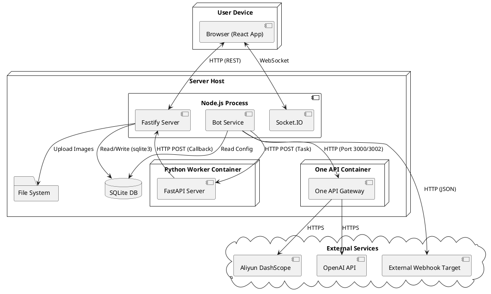

# 5. 物理视图 (Physical View)

物理视图描述了系统的部署拓扑，展示了软件组件在硬件节点上的分布以及它们之间的网络连接。它关注系统的部署架构、可扩展性以及与外部环境的集成。

## 5.1 部署架构

OpenClaw 采用典型的 **单机部署 (Single-Instance Deployment)** 架构，所有核心组件运行在同一台服务器上，通过本地网络或进程间通信（IPC）进行交互。这种架构部署简单，适合个人开发者或小型团队使用。

### 5.1.1 部署拓扑图

### 5.1.2 节点描述

*   **User Device**: 用户的终端设备（PC、手机），运行现代浏览器，通过 HTTP 和 WebSocket 与服务器通信。
*   **Server Host**: 部署 OpenClaw 后端服务的物理机或虚拟机（如 AWS EC2, Aliyun ECS）。
    *   **Node.js Process**: 运行 Fastify Web Server 和 Socket.IO Server 的主进程。
    *   **One API Container**: 运行 One API 服务的 Docker 容器，负责 LLM 接口聚合与分发。
    *   **SQLite DB**: 存储所有持久化数据的文件数据库 (`database.sqlite`)。
    *   **File System**: 存储上传的图片文件 (`data/emojis/`)。
    *   **Python Worker Container**: (可选) 运行 Python 服务的独立容器或进程，用于处理复杂计算任务。
*   **External Services**: 系统依赖的外部云服务。
    *   **OpenAI API / Aliyun DashScope**: 提供 LLM 能力，通过 One API 间接调用。
    *   **External Webhook Target**: 用户自定义的外部 HTTP 服务，用于接收 Bot 转发的消息。

## 5.2 网络通信

*   **Client -> Server**:
    *   **REST API**: `http://<host>:3001/api/...`，用于获取 Bot 列表、管理 API Key、上传图片等。
    *   **WebSocket**: `ws://<host>:3001/socket.io/`，用于实时消息收发、Typing 状态同步。
*   **Server -> One API**:
    *   **Internal HTTP**: `http://localhost:3002`，BotService 通过此端口调用统一的 LLM 接口。
*   **One API -> External**:
    *   **LLM API**: `https://api.openai.com/v1/...`，One API 使用配置的渠道 Key 进行鉴权并转发请求。
*   **Server <-> Worker**:
    *   **Task Dispatch**: `http://localhost:8000/events` (Node.js -> Python)。
    *   **Result Callback**: `http://localhost:3001/api/chat/send` (Python -> Node.js)。

## 5.3 部署环境要求

*   **操作系统**: Linux (Ubuntu/CentOS), macOS, Windows (WSL)。
*   **Docker**: 必须安装 Docker 和 Docker Compose，用于运行 One API 和 Python Worker。
*   **Node.js**: v18.0.0 或更高版本。
*   **网络**: 需要能够访问外网（连接 LLM API），且防火墙需开放 3001 端口（后端）和 5176 端口（前端开发模式）。

## 5.4 扩展性考量

虽然当前架构为单机部署，但设计上预留了水平扩展的可能性：

*   **数据库迁移**: SQLite 可无缝迁移至 PostgreSQL/MySQL，支持多实例并发写入。
*   **消息队列**: EventBus 目前基于内存，未来可替换为 Redis Pub/Sub，支持多 Server 实例间的消息同步。
*   **Worker 拆分**: Python Worker 已通过 HTTP 接口解耦，可轻松迁移至独立服务器或 Serverless 环境（如 AWS Lambda）。
*   **静态资源**: 图片上传目录可挂载至 S3/OSS 对象存储，实现无状态服务。

---

**设计决策说明**:
*   **为什么单机部署?** 降低运维成本，通过 `pm2` 即可实现进程守护和日志管理，足以应对数百人规模的聊天室。
*   **为什么集成 One API?** One API 提供了开箱即用的多模型支持和渠道管理功能，避免了在 BotService 中重复造轮子，极大地降低了对接新模型的成本。
