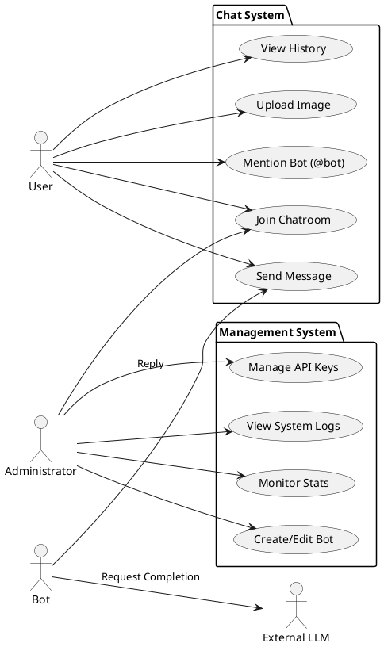
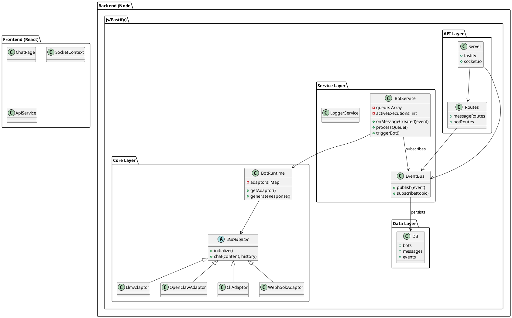
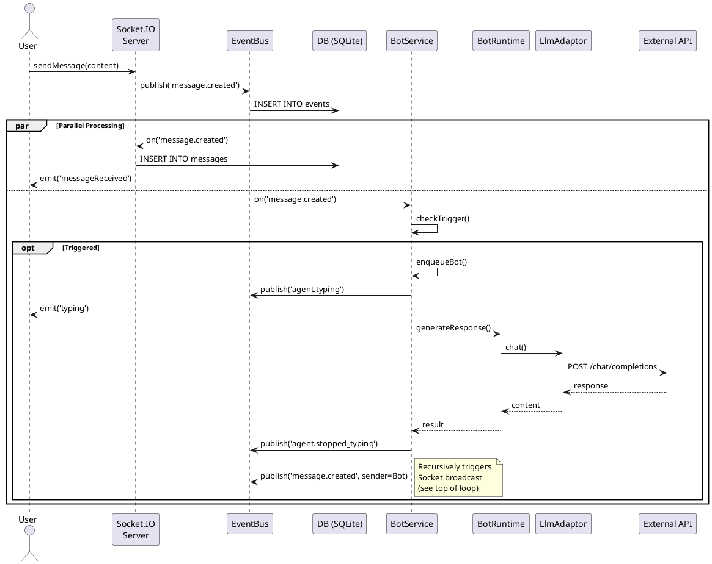
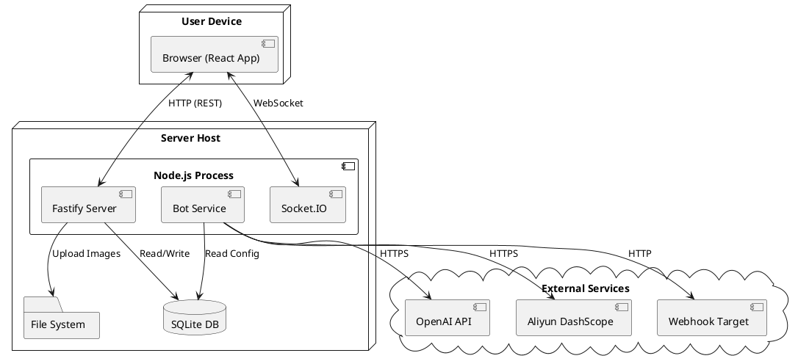

# OpenClaw 项目架构分析报告 (4+1 视图)

本报告基于当前代码库 (`oc_7c67a3a4814e100e92a4eea9a27afd95`) 生成，旨在详细展示系统的业务方案与技术实现。

## 1. 场景视图 (Scenarios / Use Case View)

场景视图描述了系统的主要参与者及其核心交互流程。

### 参与者 (Actors)
*   **User (普通用户)**: 在聊天室中与机器人或其他用户交互。
*   **Administrator (管理员)**: 配置机器人、管理 API 密钥、监控系统状态。
*   **Bot (机器人/Agent)**: 系统中的自动化代理，由 LLM 或脚本驱动。
*   **External System (外部系统)**: 如 OpenAI API, Webhook 目标服务。

### 用例图 (PlantUML)

---

## 2. 逻辑视图 (Logical View)

逻辑视图展示了系统的组件结构、分层设计及核心类关系。

### 系统分层架构

*   **Presentation Layer (前端)**: React SPA，负责 UI 展示与 WebSocket 通信。
*   **API Layer (后端接入)**: Fastify Routes (REST) + Socket.IO (Real-time)。
*   **Service Layer (核心业务)**: 包含 `BotService` (编排), `EventBus` (消息总线), `AgentService`。
*   **Core Layer (运行时)**: `BotRuntime` 负责调度不同的 Adaptor。
*   **Adaptor Layer (适配器)**: 对接不同 LLM 或执行环境 (`LlmAdaptor`, `OpenClawAdaptor`, `CliAdaptor`)。
*   **Data Layer (数据层)**: SQLite 数据库与文件存储。

### 类图/组件图 (PlantUML)

---

## 3. 过程视图 (Process View)

过程视图描述了系统的并发行为、消息流转路径及异步处理机制。

### 核心流程：消息发送与机器人回复

1.  用户通过 WebSocket 发送消息。
2.  Server 将消息发布到 EventBus。
3.  Server 监听 EventBus，将消息广播回聊天室并持久化。
4.  BotService 监听 EventBus，检测是否触发机器人。
5.  BotService 将任务加入队列 (Queue)。
6.  BotService 处理队列，调用 BotRuntime。
7.  BotRuntime 调用 LLM API 获取回复。
8.  BotService 将机器人回复发布到 EventBus。
9.  Server 广播机器人回复。

### 序列图 (PlantUML)

---

## 4. 开发视图 (Development View)

开发视图展示了软件模块的组织方式。

### 目录结构

*   **02_Development/**
    *   **backend/** (Node.js 服务端)
        *   `src/server.js`: 入口文件
        *   `src/adaptors/`: 机器人适配器实现
        *   `src/services/`: 业务逻辑 (BotService, EventBus)
        *   `src/routes/`: API 路由定义
        *   `src/controllers/`: 请求处理逻辑
        *   `src/db.js`: 数据库连接与初始化
    *   **frontend/** (React 客户端)
        *   `src/pages/`: 页面组件 (ChatPage, DashboardPage)
        *   `src/components/`: 可复用 UI 组件
        *   `src/services/`: API 客户端与 Socket 封装
        *   `src/context/`: 全局状态

### 技术栈
*   **Backend**: Node.js, Fastify, Socket.IO, SQLite (sqlite3)
*   **Frontend**: React, Vite, TailwindCSS, Socket.IO Client
*   **Communication**: HTTP REST (Management), WebSocket (Chat), EventBus (Internal)

---

## 5. 物理视图 (Physical View)

物理视图描述了系统的部署拓扑。

### 部署图 (PlantUML)

## 总结与建议

**当前架构优点**:
1.  **事件驱动**: 通过 `EventBus` 解耦了消息接收、持久化和机器人处理，便于扩展。
2.  **模块化适配器**: `BotRuntime` 通过适配器模式支持多种 LLM 和执行环境，易于新增 Provider。
3.  **混合通信**: 结合了 REST (管理) 和 WebSocket (实时)，兼顾了效率和兼容性。
4.  **轻量级**: 使用 SQLite 和本地文件系统，部署简单，适合单机或小规模团队使用。

**潜在改进点**:
1.  **并发控制**: 虽然 `BotService` 实现了队列，但 SQLite 在高并发写入下可能成为瓶颈。建议在未来迁移至 PostgreSQL/MySQL。
2.  **分布式扩展**: 目前 EventBus 是内存级别的，多实例部署时需要引入 Redis Pub/Sub。
3.  **消息可靠性**: 消息投递目前依赖内存事件，若服务崩溃可能导致任务丢失。建议引入持久化任务队列 (如 BullMQ)。
4.  **鉴权体系**: 目前 API Key 管理较为基础，缺乏细粒度的用户权限控制 (RBAC)。
